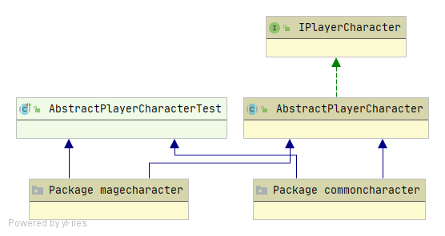
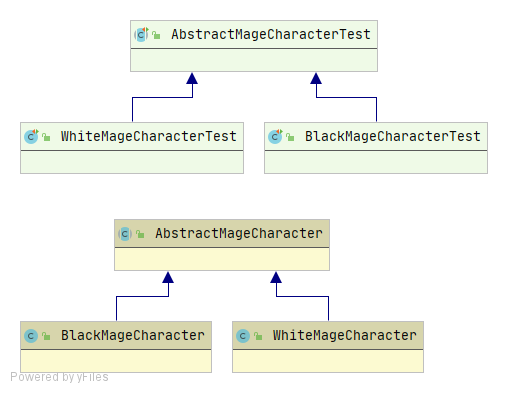

Final Reality
=============

This work is licensed under a 
[Creative Commons Attribution 4.0 International License](http://creativecommons.org/licenses/by/4.0/)

Context
-------

This project's goal is to create a (simplified) clone of _Final Fantasy_'s combat, a game developed
by [_Square Enix_](https://www.square-enix.com)
Broadly speaking for the combat the player has a group of characters to control and a group of 
enemies controlled by the computer.

---

# Fixing the order and inherit

The first we have is the **AbstractCharacter** abstract class, here you will find common attributes and
methods between enemies and playable characters, like health points, defense, name and methods
like getters, setters and *receiveDamage()*. This class implements the **ICharacter** interface.

The next class we have is the **Enemy** class, here you will find a class with the attributes and 
methods that only an enemy has, like damage, weight, burnDamage, venomDamage.

Then you will find **AbstractPlayerCharacter** abstract class, this class inherits from **AbstractCharacter**
class some methods and attributes, here you have *equip()* method, this method uses double dispatch
because every player character type (thief, knight, etc) has different weapons to equip. Another new method is
*commonAttack()*, this method targets an enemy and the *this* object attacks with the weapon that
it has, doing damage. This class implements the **IPlayerCharacter** interface

There are two big types of characters, **CommonCharacters** (like thief, knight and engineer), these characters
can't use magic, so they don't have *mana* or magic attacks, you will find an abstract class named
**AbstractCommonCharacter**, to have the methods that these type of characters will inherit, like the *hashCode()*
method.

The other big type of characters is **MageCharacters** (like black mage and white mage), these type of characters
can use magic and do magic attacks, for this exists the abstract class
**AbstractMagicCharacters**, here you will find *mana* attribute, methods to set it and get it,
all mages will inherit from this class. This class implements the **IMageCharacter** interface

For all player character types exists a class:
> - **ThiefCharacter** : This class inherits from **AbstractCommonCharacter** class 
>
> - **KnightCharacter** : This class inherits from **AbstractCommonCharacter** class 
>
> - **EngineerCharacter** : This class inherits from **AbstractCommonCharacter** class 
>
> - **BlackMageCharacter** : This class inherits from **AbstractMagicCharacter** class, here you will find methods
    for magic attacks like *thunder()* and *fire()*.
>
> - **WhiteMageCharacter** : This class inherits from **AbstractMagicCharacter** class, here you will find methods
>   for magic attacks like *paralyze()*, *venom()* and *cure()*.

All of these classes are in **character** package.

The next package is **weapon**, here you will find an abstract class called **AbstractWeapon**, with the methods and
attributes that all weapons have like weight, damage, name, all attributes have getters. All weapons have a method
with a name like *equipTo___()* where the ____ is a name of a player character class (Example: *equipToThief()*), this
is called when a player character objects calls *equip()* doing a double dispatch, only if the weapon can be equipped to 
the class of the player character, the object that called *equip()* will be equipped with the weapon, else will not. 
**AbstractWapon** class implements the **ICharacter** interface

For all weapon types exists a class:
> - **Axe** : This weapon can be equipped to **KnightCharacter**, **EngineerCharacter** classes..
>
> - **Bow** : This weapon can be equipped to **ThiefCharacter**, **EngineerCharacter** classes.
>
> - **Knife** : This weapon can be equipped to **KnightCharacter**, **BlackMageCharacter** classes.
>
> - **Staff** : This weapon can be equipped to **ThiefCharacter**, **BlackMageCharacter**, **WhiteMageCharacter** classes.
>
> - **Sword** : This weapon can be equipped to **ThiefCharacter**, **KnightCharacter** classes.
    
**Knife** and **Staff** classes implements **IMageWeapons** interface, this is because a BlackMage can try to do magic 
attacks with a knife equipped. With this interface, if a Mage do a magic attack, their weapon will call *weapon.cast()*,
this method is only for the weapons that a mage can equip, if the weapon is a **Staff**, this call will return *true*, 
because a **Staff** can cast magic attacks, in the case of the **Knife** it will returns *false*.

The last package is the **inventory**, the only class here is **Inventory** class, with attributes like a list
of **IWeapons**, a pointer to an index of the list and the len of the list. With a object of this class you can
storage weapons and access to equip the weapon indexed by the *pointer* to a character.

## Model Diagrams
- **model** 

- **character**

- **player**

- **commoncharacter**

- **magecharacter**

- **inventory**

- **weapon**

**All changes on classes were to keep SOLID principles.**

## Controller

#### Make Characters

The **Controller** can make Characters by calling make*Type*(*data*) where *Type* can be a player 
character type (like Knight, Thief, Engineer, BlackMage, WhiteMage or Enemy) and *data* depends on
the *Type*, if the type is a common player character, the *data* needed will be the name, maxHp, 
defense, if the *type* is a mage, will be needed the same and maxMana value, if the *type* is Enemy,
will be needed the name, maxHp, weight, defense and damage. 

#### Make Weapons

Weapons can be made like the characters, just by calling make*Type*(data), where the type is a weapon type 
like Sword, Axe, Bow, Knife and Staff. The data values will be the name of the weapon, the damage and the 
weight, only Staff will need one more value, the magicDamage.

#### Getters and Data

The characters will be saved in lists, one for player characters and one for enemies, to get a character just
use the getPlayerCharacter(i) where the i is the index of the wanted player character, and getEnemy(i) to do the
same but using the enemies list. For all character attributes exists methods to get them, there are for Enemy class
and for IPlayerCharacter.

#### Inventory and Equipment

The Controller makes an inventory, to move in there exists methods to move the inventory pointer up, down, left or right;
and once you are pointing the weapon you wanted, just call *equipWeaponTo(playerCharacter)* where *playerCharacter* is the
character who will be equipped with the pointed weapon.

#### Attack

There are methods to attack, one for player characters and one for enemies. Both works similar, calling the method 
with the first parameter the attacker, and the second parameter is the target of the attack.

#### Start and finish turn

A turn finishes when a character attacks, but after the attack other character receives the damage, knowing this, 
is better to consider the end of the turn at the end of receive damage method. When a character receive damage, the 
listener calls the method *turnToAvailable()* from the **Controller**, turns to *true* the *turnAvailable* boolean value
from the Controller, because the turn can be taken.
 
A turn can start only if there is a character in the **turnsQueue**, knowing this, other listener calls the method 
*waitingTurn()* from the **Controller** just after is added a character to the **turnsQueue**, this happens in the
*addToQueue()* method in **AbstractCharacter** class.

With all of this, another turn will start only if there is almost one character in the **turnsQueue**, and the turn is 
available.

#### End Game

The user wins when all enemies die, and loses when all player characters dies. To implement this, the **Controller** uses 
two listeners, one is for the enemies and the other for player characters, the listeners uses their method when a character calls
*fainted()* method, then reduce by one the count of their type of character. If the count of player characters become 0,
the user loses, if the count of enemies become 0, the user wins.

## Controller Diagram
- controller

## Assumptions

- Inventory will be used like a list of weapons.
- If the victim's defense is more than the damage that it receives, the victim will only not receive damage.
- Win, nextTurn and lose methods will be implemented the next iteration.
- A turn finishes when a character receive damage (from an attack), and the next turn starts if there is at least one 
character in the turnsQueue and there is not another character using the turn.
- The method *startTurn()* in **Controller** class will be changed in the next iteration, the method calls 
*receiveDamage()*, but this will be changed to the method of the execution of the character's turn.
