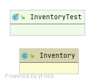

Final Reality
=============

This work is licensed under a 
[Creative Commons Attribution 4.0 International License](http://creativecommons.org/licenses/by/4.0/)

Context
-------

This project's goal is to create a (simplified) clone of _Final Fantasy_'s combat, a game developed
by [_Square Enix_](https://www.square-enix.com)
Broadly speaking for the combat the player has a group of characters to control and a group of 
enemies controlled by the computer.

---

**The rest of the documentation is left for the users of this template to complete**

# Fixing the order and inherit

The first we have is the **AbstractCharacter** abstract class, here you will find common attributes and
methods between enemies and playable characters, like health points, defense, name and methods
like getters, setters and *receiveDamage()*.

The next class we have is the **Enemy** class, here you will find a class with the attributes and 
methods that only an enemy has, like damage, weight, burnDamage, venomDamage.

Then you will find **AbstractPlayerCharacter** abstract class, this class inherits from **AbstractCharacter**
class some methods and attributes, here you have *equip()* method, this method uses double dispatch
because every player character type (thief, knight, etc) has different weapons to equip. Another new method is
*commonAttack()*, this method targets an enemy and the *this* object attacks with the weapon that
it has, doing damage.

There are two big types of characters, **CommonCharacters** (like thief, knight and engineer), these characters
can't use magic, so they don't have *mana* or magic attacks, you will find an abstract class named
**AbstractCommonCharacter**, to have the methods that these type of characters will inherit, like the *hashCode()*
method.

The other big type of characters is **MageCharacters** (like black mage and white mage), these type of characters
can use magic and do magic attacks, for this exists the abstract class
**AbstractMagicCharacters**, here you will find *mana* attribute, methods to set it and get it,
all mages will inherit from this class.

For all player character types exists a class:
> - **ThiefCharacter** : This class inherits from **AbstractCommonCharacter** class 
>
> - **KnightCharacter** : This class inherits from **AbstractCommonCharacter** class 
>
> - **EngineerCharacter** : This class inherits from **AbstractCommonCharacter** class 
>
> - **BlackMageCharacter** : This class inherits from **AbstractMagicCharacter** class, here you will find methods
    for magic attacks like *thunder()* and *fire()*.
>
> - **WhiteMageCharacter** : This class inherits from **AbstractMagicCharacter** class, here you will find methods
>   for magic attacks like *paralyze()*, *venom()* and *cure()*.

All of these classes are in **character** package.

The next package is **weapon**, here you will find an abstract class called **AbstractWeapon**, with the methods and
attributes that all weapons have like weight, damage, name, all attributes have getters. All weapons have a method
with a name like *equipTo___()* where the ____ is a name of a player character class (Example: *equipToThief()*), this
is called when a player character class uses *equip()* doing a double dispatch, only if the weapon can equip to the 
type of character, the object that called *equip()* will be equipped with the weapon, else will not.

For all weapon types exists a class:
> - **Axe** : This weapon can be equipped to **KnightCharacter**, **EngineerCharacter** classes..
>
> - **Bow** : This weapon can be equipped to **ThiefCharacter**, **EngineerCharacter** classes.
>
> - **Knife** : This weapon can be equipped to **KnightCharacter**, **BlackMageCharacter** classes.
>
> - **Staff** : This weapon can be equipped to **ThiefCharacter**, **BlackMageCharacter**, **WhiteMageCharacter** classes.
>
> - **Sword** : This weapon can be equipped to **ThiefCharacter**, **KnightCharacter** classes.

The last package is the **inventory**, the only class here is **Inventory** class, with attributes like a list
of **IWeapons**, a pointer to an index of the list and the len of the list. With a object of this class you can
storage weapons and access to equip the weapon indexed by the *pointer* to a character.

## Classes diagram
- **model** 

- **character**

- **player**

- **commoncharacter**

- **magecharacter**

- **inventory**

- **weapon**

