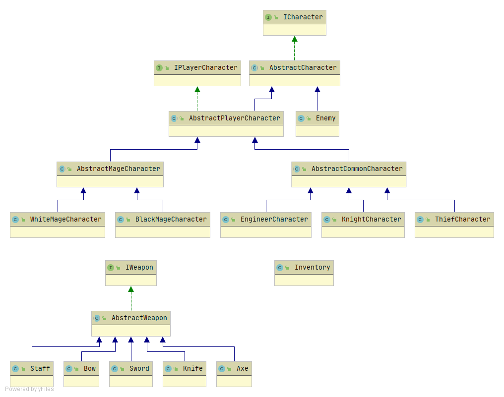
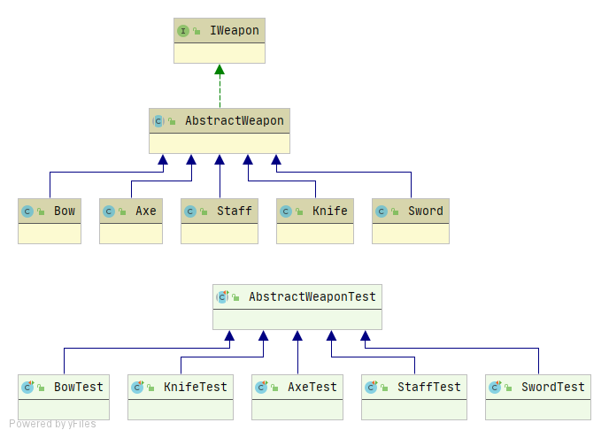

=============

This work is licensed under a 
[Creative Commons Attribution 4.0 International License](http://creativecommons.org/licenses/by/4.0/)

Context
-------

This project's goal is to create a (simplified) clone of _Final Fantasy_'s combat, a game developed
by [_Square Enix_](https://www.square-enix.com)
Broadly speaking for the combat the player has a group of characters to control and a group of 
enemies controlled by the computer.

---

# Fixing the order and inherit

The first we have is the **AbstractCharacter** abstract class, here you will find common attributes and
methods between enemies and playable characters, like health points, defense, name and methods
like getters, setters and *receiveDamage()*. This class implements the **ICharacter** interface.

The next class we have is the **Enemy** class, here you will find a class with the attributes and 
methods that only an enemy has, like damage, weight, burnDamage, venomDamage.

Then you will find **AbstractPlayerCharacter** abstract class, this class inherits from **AbstractCharacter**
class some methods and attributes, here you have *equip()* method, this method uses double dispatch
because every player character type (thief, knight, etc) has different weapons to equip. Another new method is
*commonAttack()*, this method targets an enemy and *this* object attacks with the equipped weapon, doing damage. 
This class implements the **IPlayerCharacter** interface

There are two big types of characters, **CommonCharacters** (like thief, knight and engineer), these characters
can't use magic, so they don't have *mana* or magic attacks, you will find an abstract class named
**AbstractCommonCharacter**, to have the methods that these type of characters will inherit, like the *hashCode()*
method.

The other big type of characters is **MageCharacters** (like black mage and white mage), these type of characters
can use magic and do magic attacks, for this exists the abstract class
**AbstractMagicCharacters**, here you will find *mana* attribute, methods to set it and get it,
all mages will inherit from this class.

For all player character types exists a class:
> - **ThiefCharacter** : This class inherits from **AbstractCommonCharacter** class 
>
> - **KnightCharacter** : This class inherits from **AbstractCommonCharacter** class 
>
> - **EngineerCharacter** : This class inherits from **AbstractCommonCharacter** class 
>
> - **BlackMageCharacter** : This class inherits from **AbstractMagicCharacter** class, here you will find methods
    for magic attacks like *thunder()* and *fire()*.
>
> - **WhiteMageCharacter** : This class inherits from **AbstractMagicCharacter** class, here you will find methods
>   for magic attacks like *paralyze()*, *venom()* and *cure()*.

All of these classes are in **character** package.

The next package is **weapon**, here you will find an abstract class called **AbstractWeapon**, with the methods and
attributes that all weapons have like weight, damage, name, all attributes have getters. All weapons have a method
with a name like *equipTo___()* where the ____ is a name of a player character class (Example: *equipToThief()*), this
is called when a player character objects calls *equip()* doing a double dispatch, only if the weapon can be equipped to 
the class of the player character, the object that called *equip()* will be equipped with the weapon, else will not. 
**AbstractWapon** class implements the **ICharacter** interface

For all weapon types exists a class:
> - **Axe** : This weapon can be equipped to **KnightCharacter**, **EngineerCharacter** classes..
>
> - **Bow** : This weapon can be equipped to **ThiefCharacter**, **EngineerCharacter** classes.
>
> - **Knife** : This weapon can be equipped to **KnightCharacter**, **BlackMageCharacter** classes.
>
> - **Staff** : This weapon can be equipped to **ThiefCharacter**, **BlackMageCharacter**, **WhiteMageCharacter** classes.
>
> - **Sword** : This weapon can be equipped to **ThiefCharacter**, **KnightCharacter** classes.
    
The last package is the **inventory**, the only class here is **Inventory** class, with attributes like a list
of **IWeapons**, a pointer to an index of the list and the len of the list. With a object of this class you can
storage weapons and access to equip the weapon indexed by the *pointer* to a character.

## Model Diagrams
- **model** 

- **character**

- **player**

- **commoncharacter**

- **magecharacter**

- **inventory**

- **weapon**

**All changes on classes were to keep SOLID principles.**

## Controller

#### Make Characters

The **Controller** can make Characters by calling make*Type*(*data*) where *Type* can be a player 
character type (like Knight, Thief, Engineer, BlackMage, WhiteMage or Enemy) and *data* depends on
the *Type*, if the type is a common player character, the *data* needed will be the name, maxHp, 
defense, if the *type* is a mage, will be needed the same and maxMana value, if the *type* is Enemy,
will be needed the name, maxHp, weight, defense and damage. 

#### Make Weapons

Weapons can be made like the characters, just by calling make*Type*(data), where the type is a weapon type 
like Sword, Axe, Bow, Knife and Staff. The data values will be the name of the weapon, the damage and the 
weight, only Staff will need one more value, the magicDamage.

#### Getters and Data

The characters will be saved in lists, one for player characters and one for enemies, to get a character just
use the *getPlayerCharacter(i)* where the i is the index of the wanted player character, and *getEnemy(i)* to do the
same but using the enemies list. For all character attributes exists methods to get them, there are for Enemy class
and for **IPlayerCharacter**.

#### Inventory and Equipment

The **Controller** makes an *inventory* (from **Inventory** class), to move in there exists methods to move the 
inventory pointer up, down, left or right; and once you are pointing the weapon you wanted, just call 
*equipWeaponTo(playerCharacter)* where *playerCharacter* is the character who will be equipped with the pointed weapon.

#### Attack

There are methods to attack, one for player characters and one for enemies. Both works similar, calling the method 
with the first parameter the attacker, and the second parameter is the target of the attack.

### Phases

The game uses **five** phases, one is the **WaitingPhase**, here the game waits looking if the queue adds a character, if
happens the game changes to **DecisionPhase**, here the controller takes a character from the queue an depending of his
type changes to **EnemyPhase** or **PlayerPhase**.

In the **EnemyPhase**, the turn is for an enemy, so just does an automatic attack, at **PlayerPhase**, the game waits for
inputs by the user, here the user can equip weapons, select weapons, attack and select target. Both phases ends
when a character attacks an alive character, when this happens return to waiting phase looking if there is a character in
the queue to start a new turn.

The las phase is **EndPhase**, this phase will be setted when the game ends, just to stop the game.

#### Start and finish turn

A turn finishes when a character attacks, this activates the observer and turns to
waiting phase.  When a new character enters to the queue, activates the *newTurn()* method and depending on the actual 
phase, starts a new turn (this happens when the actual phase is **WaitingPhase**).
 
When a turn starts, the phase changes to **DecisionPhase**, here if the character that uses the turn is an **Enemy**, the
character does an automatic attack, if the character was a **PlayerCharacter**, the game waits for the user decisions.

#### End Game

The user wins when all enemies die, and loses when all player characters dies. To implement this, the **Controller** uses 
two listeners, one is for the enemies and the other for player characters, the listeners uses their method when a character calls
*fainted()* method, then reduce by one the count of their type of character. If the count of player characters become 0,
the user loses, if the count of enemies become 0, the user wins.

## Controller Diagram
- controller

## GUI

- Main View:

1) There are three counters, the players counter increase when a player character is added, the enemies counter 
 increase when you add an enemy, the weapons counter increase when a weapon is added. The game requires at least 
 one of each, and you can't exceed 4 players, 8 enemies and 12 weapons.

2) There are five inputs, to make a player you need to fill *name*, *maxHp* and *defense*. To make an enemy you need
    to fill *name*, *maxHp*, *defense*, *damage* and *weight*. To make a weapon you nedd to fill *name*, *damage* and *weight*.

3) Starts a new game, making a default set up of characters, enemies and weapons.

4) Starts a game with the added player characters, enemies and weapons.

5) Makes a player character using the inputs from **2**.

6) Makes an enemy using the inputs from **2**.

7) Makes a weapon using the inputs from **2**.

- BattleView (waiting for turn)

1) Player character images.

2) Info about player characters (name, hp, def and weight).

3) Inventory.

4) Actual pointed weapon.

5) Game buttons.

6) Info about weapons (name, damage, weight).

7) Weapon image.

- BattleView (player's turn)

1) Actual player character.

2) Actual pointed weapon

3) Buttons to point the previous enemy or the next.

4) Mark to the actual pointed enemy.

5) Button to attack the actual pointed enemy using the actual player character.

6) Buttons to move the inventory pointer and equip the actual pointed weapon to the actual
 player character.

## Playing

When the game starts you will see the main view, here you can choose if you want to just play by clicking
**Play with default configurations.** this button makes default characters and starts a game. If you want to make your 
own game, you have to make at least one *player character*, one *enemy* and one *weapon*, there you have three counters
to know how many objects you create, the max quantity of player characters is **4**, of enemies **8** and weapons **12**,
finally to start the game click on **start** button.

All games starts with player characters using a toy weapon, this weapon has the value *20* for weight and *0* for damage
so you will need one weapon to do damage.

When the game starts the view changes to a battle scene, with your player characters at left and enemies at right, 
weapons are in the bottom, here you will see all the information about characters and 
weapons, to play just wait for your turn, when a player character has an arrow at the left, is your turn and you are
using the character with the arrow.

From this phase you can equip weapons to the actual character using the buttons, using the **Attack** button will make 
the actual player attacks the enemy with *red aura* if you want to attack other enemy use the buttons to point another.
The phase will ends when the actual character does an attack to a alive enemy.

The enemies turns are automatic, when the game finishes you will see if you won or lose.
Good Luck. 

## Assumptions

- Inventory will be used like a list of weapons.
- If the victim's defense is more than the damage that it receives, the victim will only not receive damage.
- Win, nextTurn and lose methods will be implemented the next iteration.
- A turn finishes when a character attacks, and the next turn starts if there is at least one 
character in the turnsQueue and there is not another character using the turn.
- All players starts with a toy weapon (weapon with 0 damage and 20 weight).